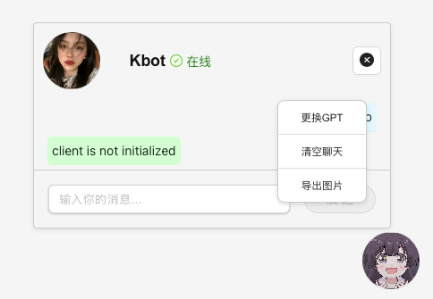

# 实习日志平台

## 关于

这是一个基于 Wails 框架编写的实习日志平台，最初开发于 2022 年 OpenAI 刚出现时。该项目旨在帮助学生完成学校布置的实习日志任务。

## 技术栈

- **后端**: Go
- **前端**: React
- **通信**: WebSocket
- **框架**: Wails

## 项目结构

### 后端

后端实现了多个实用包，功能模块化设计，主要包括以下部分：

- **Bot**: 提供自动化聊天机器人功能，包含事件处理和消息处理模块。
- **Captcha**: 验证码生成与识别。
- **Chat**: 聊天功能核心逻辑。
- **Spider**: 数据抓取与模拟操作。
- **Docker**: 包含 OCR 相关的 Dockerfile 和 Python 脚本。
- **Event**: 处理用户认证、授权和流式数据传输。
- **Util**: 提供队列和其他辅助工具。

### 前端

前端采用 React 编写，包含以下主要功能：
- 日志编辑器
- 聊天窗口
- 用户登录与设置页面

## 项目状态

本项目已暂时废弃，但由于其模块化设计和清晰的代码结构，仍然可以作为参考。希望它能为大家提供一些启发！


## README Prompt

```prompt
+ Using Vscode => [Roo-Code]
学习一下我的整个项目结构重点关注后端部分，后端实现了很多实用包，整个项目是用 wails 编写的.
采用 go + react + websoket 便携，用来编写实习日志的.
这是 21 年 OpenAI 刚出现的时候编写的项目，用于给编写学校布置的实习日志的平台。
请介绍一下项目，感谢技术提供商，并且指明我的项目已经暂时废弃了，
但是可以参考，希望能给大家一个启发，整个 README 需要编写好看、标准一些。
参考我的 @/docs  中的图片，为我的 README 编写对应的展示部分。
```
---

如有任何问题或建议，请随时联系作者。

## 功能展示

以下是项目的主要功能界面截图：

### 登录页面


### 首页


### 日志编辑器


### 聊天窗口
#### 浮动聊天窗口


#### 鼠标交互


### 设置页面


## 致谢

感谢以下技术提供商的支持：
- [OpenAI](https://openai.com)
- [Wails](https://wails.io)